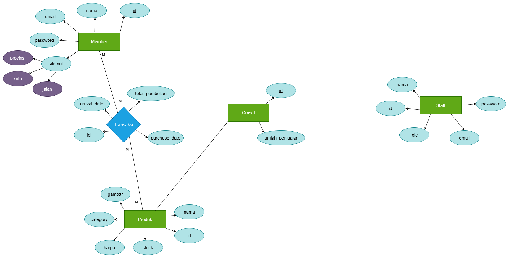

# ⋆˚✿˖° Batik Hub Marketplace ˏ༻❁༺ˎ

**Batik Hub** is a platform for buying batik products such as fabric🧵, clothing👕, and accessories☂️. I created this platform because no company or MSME (Micro, Small and Medium Enterprises or in Indonesia called UMKM) in Indonesia has a website for purchasing batik-patterned products without involving a third party, making it difficult for people, especially international customers🌏, to purchase batik-patterned products. In fact, this issue has also been raised by Instagram user David Alfa Sunarna (`@davidalfasunarna`), who encouraged MSMEs to create their own marketplaces to sell their products. This aligns with the international trend of selling products on their own websites without relying entirely on third-party marketplaces🛍️.

Although I **haven't published** Batik Hub, I hope this idea can be realized by myself or others in the future. My goal in creating this project is to improve my programming logic 🚀 and **as a portfolio** for the industrial world 🏬.

## 🛠️ Tech Stack & Dependencies
The technologies and tools I used to build this platform include:

### 🚀 Core Technologies
- **Backend Framework:** Java with Spring Boot 4.x
- **Database:** PostgreSQL (Relational Database Management System)
- **Frontend Styling:** Tailwind CSS (for responsive and modern web styling)

### 🧰 Utilities & Libraries
- **Spring Data JPA & Hibernate:** For Object-Relational Mapping (ORM) and seamless database communication.
- **Mustache:** As the server-side template engine for rendering dynamic HTML views.
- **Lombok:** To eliminate boilerplate code.
- **Validation (Jakarta Validation):** For robust data constraints and request payload validation.
- **Spring Configuration Processor:** For generating metadata for custom configuration properties.

### 📦 Project Dependencies
When initializing the project on Spring Initializr [start.spring.io](http://start.spring.io/), the following baseline dependencies were selected:
- `Spring Data JPA` — Robust data persistence layer.
- `Spring Web` — Build RESTful APIs and MVC applications using Spring MVC.
- `Mustache` — Lightweight and logic-less templating framework.
- `Lombok` — Developer productivity tool to reduce boilerplate Java code.
- `Validation` — Java Bean Validation support using Hibernate Validator.
- `Spring Configuration Processor` — Generating metadata for developer.

## Database Architecture (ERD)

  

There are 3 main entities :

- Member
- Produk
- Omset

The `Member`👥 entity has a **Many-to-Many** relationship with the `Produk`📦 entity because many buyers can buy many products at once. However, I need additional data between these two entities, namely the purchase date📅 and the date the products arrived🚚, so I added a transaction to the ERD, namely `Transaksi`💳. In addition, the relationship between `Produk` and `Omset`📊 is **One-to-One** because one product can only have one in the `Omset` table. If there is a new transaction, the `Omset` table will automatically update through the `Produk` table and there is no need to add new data to the `Omset` table, just update the `jumlah_penjualan` column.

Additionally, I also added a `Staff`👔 table, which isn't related to any other entities. There's no specific reason to add this table. However, I want this application to run according to industry standards, as there will definitely be employees using the application, so a `Staff`👔 table is necessary. The reason this table doesn't have a relationship with any other entities is because there's no corresponding table to relate it to, so I decided to leave this table as a standalone table without any relationships.